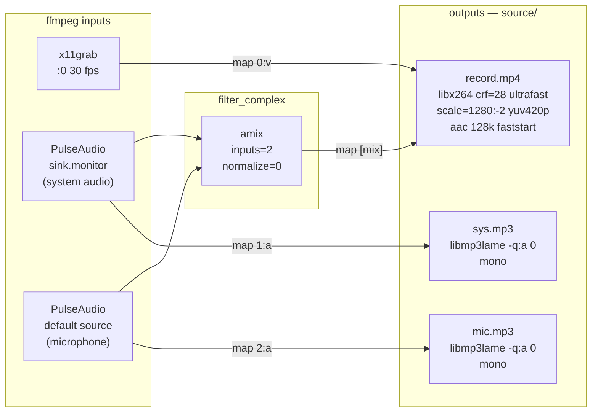
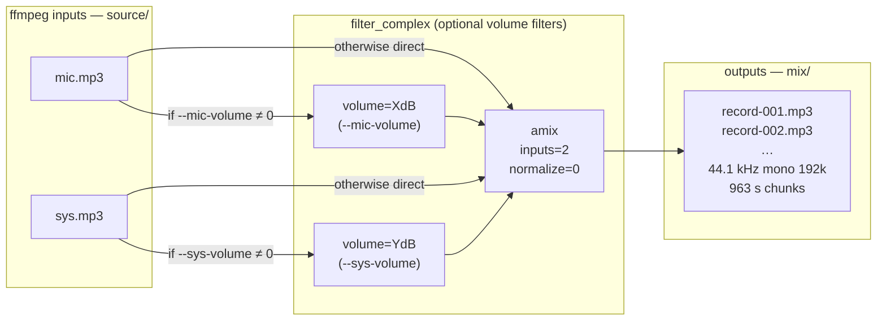
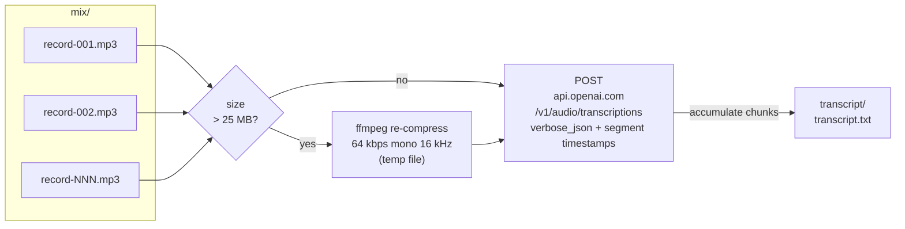
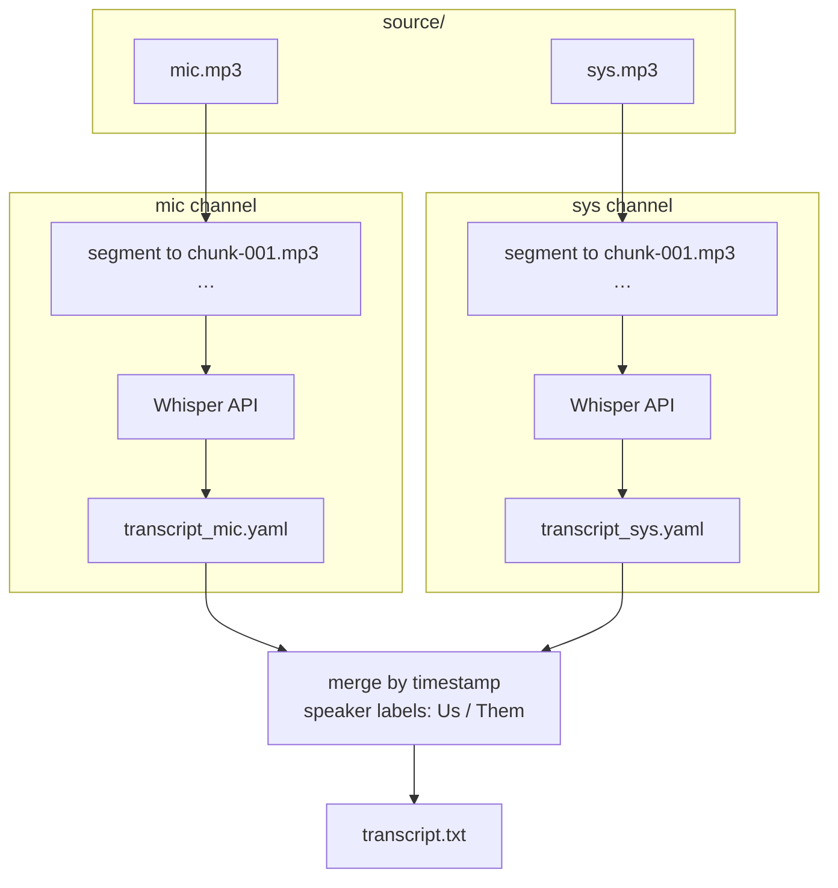
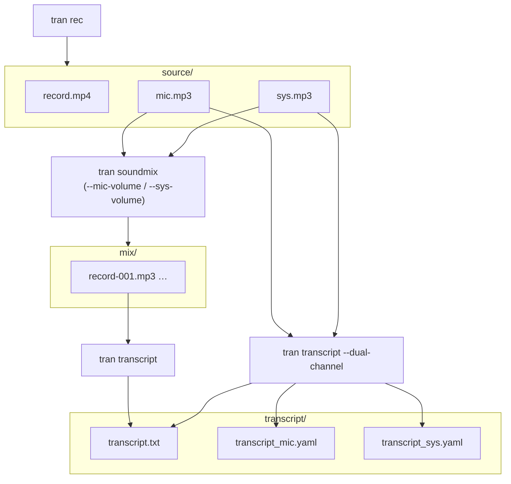

# tran

Go CLI for meeting-centric recording and transcription.

Supports two processing pipelines:

- mixed pipeline: `soundmix` combines mic + system audio into `mix/record-*.mp3`, then `transcript` produces a chunked transcript
- dual-channel pipeline: `transcript --dual-channel` transcribes `source/mic.mp3` and `source/sys.mp3` separately, then merges them into a single speaker-labelled transcript

## Install

```bash
make install   # installs to $GOPATH/bin/tran
# or
task install
```

**Linux:** requires `ffmpeg` and `pactl` (PulseAudio) on `$PATH`.

**macOS:** requires `ffmpeg`, [audiotee](https://github.com/makeusabrew/audiotee),
and permissions for Screen Recording + Microphone. See [docs/macos.md](docs/macos.md).

## Config

`~/.config/tran/config` (godotenv format). Environment variables override file values.

Minimal example:

```
FFMPEG_BIN=ffmpeg
STT_PROVIDER=openai
OPENAI_API_KEY=sk-...
```

### Guides

- **[STT providers](docs/stt-providers.md)** — OpenAI, Groq, whisper.cpp, MLX: setup, switching, tests
- **[macOS prerequisites](docs/macos.md)** — audiotee, permissions, microphone index, BT headphones

`STT_PROVIDER` is required only for `tran transcript` and `tran process`.
`tran rec`, `tran soundmix`, and `tran devices list` do not need STT config.

## Meeting directory layout

```
2026-03-27-16-30-00--Hr-interview-with-Alena/
  source/
    record.mp4      video archive (H.264, mixed audio)
    mic.mp3         raw microphone, lossless quality
    sys.mp3         raw system audio, lossless quality
  mix/
    record-001.mp3  normalised chunks for transcription
    record-002.mp3
  transcript/
    transcript.txt
    transcript_mic.yaml   dual-channel intermediate
    transcript_sys.yaml   dual-channel intermediate
```

`mix/` is only used by the mixed pipeline. The dual-channel pipeline reads directly
from `source/mic.mp3` and `source/sys.mp3`.

## Commands

### `tran rec [name]`

Start recording. Creates a timestamped meeting directory and launches a
single ffmpeg process that writes three files simultaneously to `source/`.
Stop with **Ctrl+C** — ffmpeg receives SIGINT and flushes all outputs cleanly.

```
tran rec "HR interview with Alena"
```

### `tran soundmix`

Run from the meeting directory. Reads `source/mic.mp3` and `source/sys.mp3`,
mixes them, and segments the result into `mix/record-NNN.mp3` chunks
(≤ 23 MB each, sized for the Whisper API 25 MB limit).

```
tran soundmix                        # flat mix, no adjustments
tran soundmix --mic-volume 6         # boost mic by +6 dB
tran soundmix --sys-volume -3        # reduce system audio by 3 dB
tran soundmix --mic-volume 6 --sys-volume -3
```

| Flag | Default | Description |
|---|---|---|
| `--mic-volume` | `0` | Microphone gain in dB |
| `--sys-volume` | `0` | System audio gain in dB |

### `tran transcript`

Run from the meeting directory. Sends each `mix/record-NNN.mp3` chunk to the
configured STT provider and writes `transcript/transcript.txt` with segment-level
timestamps.

With `--dual-channel` / `-d`, skips `mix/` entirely: `source/mic.mp3` and
`source/sys.mp3` are segmented separately, transcribed independently, written to
`transcript/transcript_mic.yaml` and `transcript/transcript_sys.yaml`, then
merged into `transcript/transcript.txt` with `Us` / `Them` speaker labels.

Files larger than 25 MB are automatically re-compressed to a 64 kbps / 16 kHz
mono temp file before upload.

Accepts `--lang` / `-l` to explicitly set the transcription language. Use an
ISO 639 language code with 2 or 3 letters like `en`, `eng`, or `pol`. The
default is `en`. Use `auto` to send an empty `language` parameter to the API.

```bash
tran transcript --lang en
tran transcript --lang eng
tran transcript --lang auto
tran transcript --dual-channel
tran transcript --dual-channel --lang pl
```

### `tran process`

Run from the meeting directory. Detects and runs whichever steps are still
missing.

Default pipeline:

`source/mic.mp3` + `source/sys.mp3` → `soundmix` → `mix/record-NNN.mp3` → `transcript`

Dual-channel pipeline:

`source/mic.mp3` + `source/sys.mp3` → `transcript --dual-channel`

```
tran process                         # run missing steps with defaults
tran process --mic-volume 6          # pass volume flags to soundmix step
tran process --lang pl               # force Polish for the transcript step
tran process --lang pol              # same, using a 3-letter ISO 639 code
tran process --lang auto             # let the API auto-detect language
tran process --dual-channel          # skip soundmix, transcribe both channels separately
```

Accepts `--lang` / `-l`, `--dual-channel` / `-d`, plus the same
`--mic-volume` / `--sys-volume` flags as `soundmix`.
Volume flags are only applied if the soundmix step actually runs (i.e. no
`mix/` chunks exist yet). In dual-channel mode, volume flags are ignored because
the soundmix step is skipped.

## Typical workflow

```bash
tran rec "team standup"
# ... meeting happens, Ctrl+C to stop ...

cd 2026-04-02-*--team-standup/
tran process
```

For speaker-labelled transcripts:

```bash
tran rec "candidate screening"
# ... meeting happens, Ctrl+C to stop ...

cd 2026-04-02-*--candidate-screening/
tran process --dual-channel
```

Or step by step:

```bash
tran soundmix --mic-volume 3
tran transcript --lang en
```

Or step by step in dual-channel mode:

```bash
tran transcript --dual-channel --lang en
```

---

## Data flow diagrams

### `tran rec` — ffmpeg graph



### `tran soundmix` — ffmpeg graph



### `tran transcript` — chunk pipeline



### `tran transcript --dual-channel` — dual-channel pipeline



### Full processing pipelines


