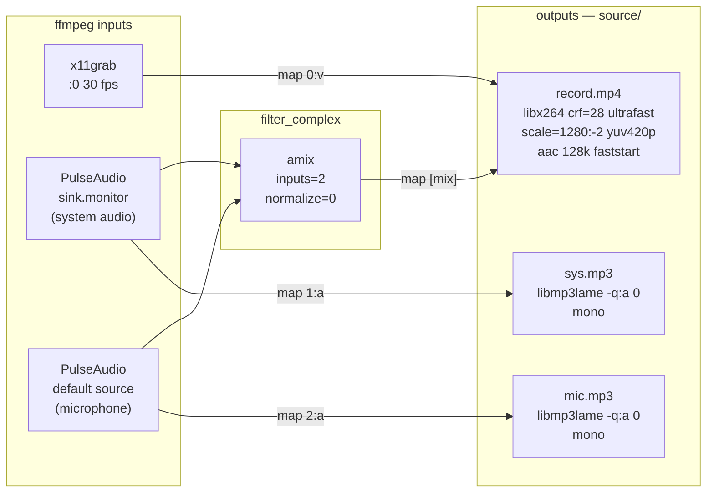
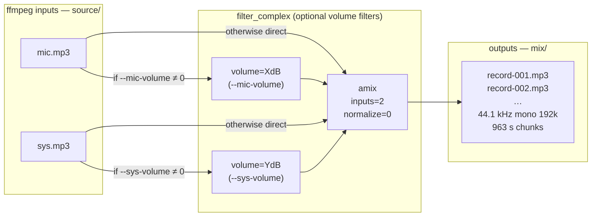
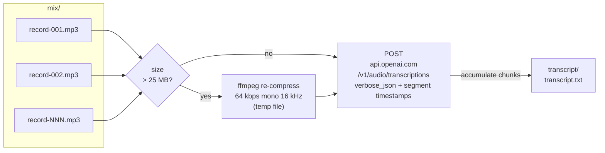
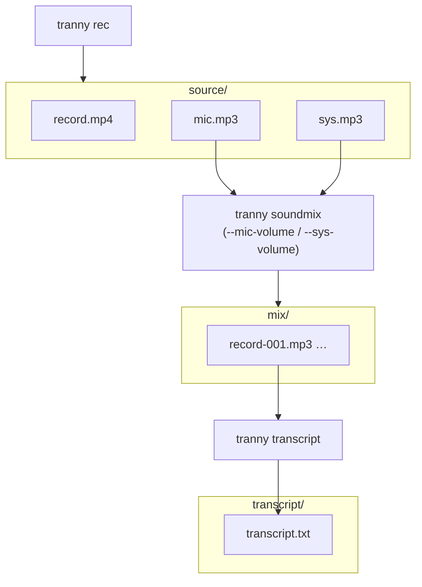

# tranny

Go CLI for meeting-centric recording and transcription.

## Install

```bash
make install   # installs to $GOPATH/bin/tranny
```

Requires `ffmpeg` and `pactl` (PulseAudio) on `$PATH`.

## Config

`~/.config/tranny/config` (godotenv format):

```
OPENAI_API_KEY=sk-...
OPENAI_MODEL_STT=whisper-1
FFMPEG_BIN=ffmpeg
DISPLAY=:0
```

Environment variables override file values.

## Meeting directory layout

```
2026-03-27-16-30-00--Hr-interview-with-Alena/
  source/
    record.mp4      video archive (H.264, mixed audio)
    mic.mp3         raw microphone, lossless quality
    sys.mp3         raw system audio, lossless quality
  mix/
    record-001.mp3  normalised chunks for transcription
    record-002.mp3
  transcript/
    transcript.txt
```

## Commands

### `tranny rec [name]`

Start recording. Creates a timestamped meeting directory and launches a
single ffmpeg process that writes three files simultaneously to `source/`.
Stop with **Ctrl+C** — ffmpeg receives SIGINT and flushes all outputs cleanly.

```
tranny rec "HR interview with Alena"
```

### `tranny soundmix`

Run from the meeting directory. Reads `source/mic.mp3` and `source/sys.mp3`,
mixes them, and segments the result into `mix/record-NNN.mp3` chunks
(≤ 23 MB each, sized for the Whisper API 25 MB limit).

```
tranny soundmix                        # flat mix, no adjustments
tranny soundmix --mic-volume 6         # boost mic by +6 dB
tranny soundmix --sys-volume -3        # reduce system audio by 3 dB
tranny soundmix --mic-volume 6 --sys-volume -3
```

| Flag | Default | Description |
|---|---|---|
| `--mic-volume` | `0` | Microphone gain in dB |
| `--sys-volume` | `0` | System audio gain in dB |

### `tranny transcript`

Run from the meeting directory. Sends each `mix/record-NNN.mp3` chunk to the
OpenAI Whisper API and writes `transcript/transcript.txt` with segment-level
timestamps.

Files larger than 25 MB are automatically re-compressed to a 64 kbps / 16 kHz
mono temp file before upload.

Accepts `--lang` / `-l` to explicitly set the transcription language. Use an
ISO 639 language code with 2 or 3 letters like `en`, `eng`, or `pol`. The
default is `en`. Use `auto` to send an empty `language` parameter to the API.

```bash
tranny transcript --lang en
tranny transcript --lang eng
tranny transcript --lang auto
```

### `tranny process`

Run from the meeting directory. Detects and runs whichever steps are still
missing: soundmix → transcript.

```
tranny process                         # run missing steps with defaults
tranny process --mic-volume 6          # pass volume flags to soundmix step
tranny process --lang pl               # force Polish for the transcript step
tranny process --lang pol              # same, using a 3-letter ISO 639 code
tranny process --lang auto             # let the API auto-detect language
```

Accepts `--lang` / `-l` plus the same `--mic-volume` / `--sys-volume` flags as
`soundmix`.
Volume flags are only applied if the soundmix step actually runs (i.e. no
`mix/` chunks exist yet).

## Typical workflow

```bash
tranny rec "team standup"
# ... meeting happens, Ctrl+C to stop ...

cd 2026-04-02-*--team-standup/
tranny process
```

Or step by step:

```bash
tranny soundmix --mic-volume 3
tranny transcript --lang en
```

---

## Data flow diagrams

### `tranny rec` — ffmpeg graph



### `tranny soundmix` — ffmpeg graph



### `tranny transcript` — chunk pipeline



### Full pipeline


